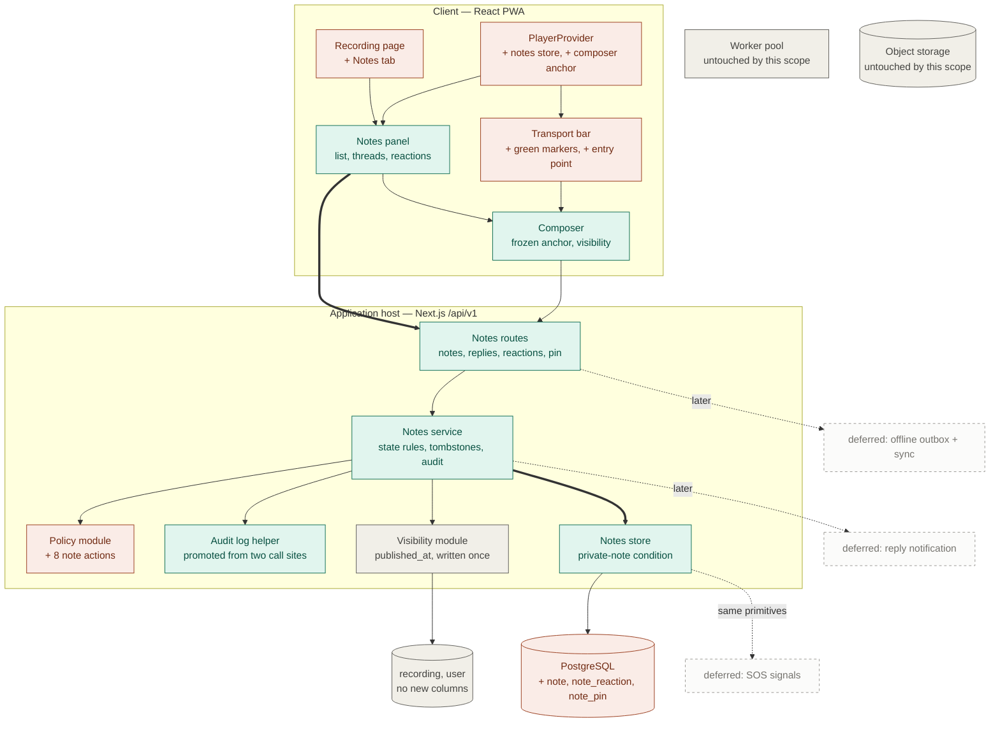

# Teaching Hub — Active-scope architecture: notes

_Reach: **Generalise threads, reactions and moderation** (active-scope prd 1.3). The one-level
thread, the one-reaction-per-member record, the admin-moderation-with-audit path and the
author-owned-content rule are designed as primitives notes are the first user of, with
project prd 3.16 SOS signals as the named beneficiary._

---

## 1. Overview

Notes are one new table, two small tables beside it, one service, one read query that owns a privacy
condition, and eight policy actions. Nothing else on the server moves: no worker step, no queue job,
no provider call, no object-store path, no new deployment unit.

A note is a row on `note` carrying a recording, an author, an optional parent, an optional
millisecond offset and a visibility. Replies are the same row with a parent and no offset, which is
what makes "a reply is a note carrying a parent" (active-scope prd 3.3.1) a fact about the schema
rather than a convention. Reactions are a second table whose primary key **is** the one-per-member
rule. The pin is a third table keyed by the note, so "a note is pinned at most once" is likewise a
key rather than a check.

On the client, the whole of a recording's notes is fetched once when the recording is opened and
held by the existing `PlayerProvider`, beside the transcript it already holds for the same reason:
the transport travels with the member (active-scope prd 3.2.7) and its markers must outlive the
recording page exactly as the caption pill does. The Notes panel renders the list from that store;
the transport derives its markers from the same array. One source, so a deleted note cannot vanish
from the list and leave its tick behind.

Everything a member is refused is refused by the API. *Who may* is answered by the policy module;
*what state the resource is in* is answered by the service; *which rows come back* is answered by
the query. Those three are deliberately separate, and section 8 says which refusal is whose.

---

## 2. Builds on

| What already runs | The seam notes land on | Kind |
| :---- | :---- | :---- |
| `packages/web/src/server/auth/policy.ts` | `PolicyRule.requiresOwnership` — the flag the file's own comment says was built for "a note, a highlight, a progress row". Notes are its second user after `profile.update`. | attaches |
| `packages/web/src/server/auth/authorise.ts` | `authorise(actor, action, target, resource)` — asking the policy module **inside a handler**, which is the only way an owned action can be asked, because `permits(...)` is evaluated at module load and cannot carry a note's author. | attaches |
| `packages/web/src/server/api/route.ts` | `apiRoute(access, handler)` — the correlation id, the envelope, the refusal path, and the route sweep. Every notes route is declared through it, so no notes route can exist without stating who may call it. | attaches |
| `packages/db/src/visibility.ts` | `findVisibleRecording(id, { includeUnpublished: false })` — the one place `published_at` may be compared, enforced by `tests/guards/visibility-boundary.test.ts`. Every notes read and every notes write calls it first, exactly as `server/transcripts/service.ts` does. **No notes query compares `published_at`.** | attaches |
| `packages/web/src/app/(member)/player-context.tsx` | `PlayerProvider` — already owns the loaded recording, `currentMs`, `seekToMs` and the transcript. Notes join it. | changes (§5.1) |
| `packages/web/src/app/(member)/transport-bar.tsx` | The scrubber `<input type="range">` and the `···` toolbar, which today holds one item. | changes (§5.2) |
| `packages/web/src/app/(member)/recordings/[id]/recording-view.tsx` | The tab strip, which today holds one tab and was built as a `role="tablist"` for exactly this. | changes (§5.3) |
| `packages/web/src/app/tokens.css` | `--color-notes: #22C55E` and `--color-notes-bg: #03352B` **already exist** and nothing uses them. Notes are the first and only feature entitled to them (style guide principle 5). No token is added. | attaches, unchanged |
| The `audit(actor, action, target)` log shape | Written twice today — `server/recordings/publication.ts` and `server/series/service.ts`. Notes need a third. | changes (§5.4) |

Nothing here attaches somewhere unanticipated. The one seam that had to be checked and holds is
`requiresOwnership`: its ownership gate **denies when no resource is given**, so an owned action
asked in the abstract is refused rather than granted — which is the property every author-owned rule
in active-scope prd 3.7 depends on.

---

## 3. Diagram

**What it proves:** a whole conversation feature — threads, reactions, moderation — reaches the
database through one service and one store module, and never reaches the worker pool, the queue, the
object store or an external provider at all. Six boxes are new, five are edits to files that already
run, and the four ghosts are the features that will attach to this without changing it.

**Legend.** Green — added by this scope. Red — already there, reshaped here; the category to read
first. Grey — already running, untouched. Dashed — deliberately not built, drawn so it stays that
way.

---

## 4. Components

New only. Section 5 carries everything already built that this scope reshapes.

### 4.1 Notes store — `packages/db/src/notes.ts`

**Owns** every statement that reads or writes `note`, `note_reaction` and `note_pin`, and — the
reason it is a module rather than queries beside a route — **the private-note condition**,
`visibility = 'public' or author_id = :me`, written exactly once. It also owns the tombstone rule: a
deleted top-level note is returned only while it still has an undeleted reply, and a deleted reply
is not returned at all.

**Does not own** any comparison of `recording.published_at`. That belongs to `visibility.ts` and the
guard refuses a second statement of it; this module is handed a recording id the service has already
gated. It owns no authorisation either: it answers "which rows", never "may this person".

**Crosses its boundary:** row types in, row types out, an `Executor` so a caller can pull it into a
transaction — the same shape `transcripts.ts` and `playback.ts` already take. Drizzle never leaves
the package; the import-boundary guard enforces that.

### 4.2 Note privacy guard — `tools/note-privacy.ts` + `tests/guards/note-privacy.test.ts`

**Owns** the check that the private-note condition is written once: a predicate over
`note.visibility` or `note.author_id` anywhere outside 4.1 fails the build, and the owning module is
asserted to actually state it, so a pass cannot silently mean "nothing checks privacy at all".

Modelled on `tools/visibility-boundary.ts` and shipped **beside** it rather than inside it. The
shipped guard is about recording publication and six read paths depend on it; extending it would put
this scope's regression risk onto a rule this scope does not touch. Two guards, one concept each.

The Privacy NFR is the whole reason it earns its place now: "a private note is excluded by the query
that reads notes, not by the interface that renders them" is a claim, and this is what makes the
claim checkable rather than reviewed.

### 4.3 Notes service — `packages/web/src/server/notes/service.ts`

**Owns** the state rules the schema cannot carry, and the order they are asked in: recording still
published → actor permitted → resource in a state that admits the action → write → audit if the
write was moderation. Concretely it owns refusing a reply whose parent is a reply, a reply to a
private note, a reaction to a private note, a pin of a reply or of a private note, and any action on
a note already deleted. Section 8 says what each becomes on the wire.

**Does not own** authorisation (it asks `authorise`), row selection (it asks 4.1) or the publication
gate (it asks `findVisibleRecording`).

**Crosses its boundary:** an `Actor`, a recording id or note id, an unvalidated body; out, the wire
shapes from 4.5. It writes the pin-clear and the note-delete in **one transaction**, because 3.6.9
is not something two separate statements can promise.

### 4.4 Notes routes — under `packages/web/src/app/api/v1/`

Eight, each declared through `apiRoute` and therefore each carrying a stated access rule:

| Route | Access | Notes |
| :---- | :---- | :---- |
| `GET /recordings/{id}/notes` | `permits('note.read')` | The whole payload for this member: pinned notes, top-level notes with their threads and reactions. |
| `POST /recordings/{id}/notes` | `permits('note.write')` | Create. `parentId` optional in the body — **one create route, not two**, because a reply is a note with a parent and a second route would be a second validation path for the same text rules. The recording in the path is authoritative; a parent on another recording is refused. |
| `PATCH /notes/{id}` | `SESSION`, then `authorise('note.edit', …)` | Text only (3.5.3). |
| `DELETE /notes/{id}` | `SESSION`, then `note.delete` falling through to `note.moderate` | See section 8. |
| `PUT /notes/{id}/reaction` | `SESSION`, then `authorise('note.react', …)` | Set or replace (3.4.3). |
| `DELETE /notes/{id}/reaction` | `SESSION`, then `authorise('note.react', …)` | Clear (3.4.4). |
| `PUT /notes/{id}/pin` | `permits('note.pin')` | Raise a note. Addressed on the **note**, not the recording: with any number of pins a recording no longer has *a* pin to `PUT`. Idempotent (3.6.6). |
| `DELETE /notes/{id}/pin` | `permits('note.unpin')` | Lower one, leaving the rest (3.6.7). |

The four `SESSION` declarations are not a weakening. `permits(...)` is evaluated when the module
loads, so it cannot carry a resource discovered per request — which is precisely why `authorise`
exists and why `users/[id]/route.ts` already reads this way. The decision still happens in one
place; only the moment it is asked moves.

### 4.5 Wire contract — `packages/shared/src/notes.ts`, `packages/shared/src/reactions.ts`

**Owns** the payload and request shapes, the path helpers, the 1,000-character ceiling as one
exported constant read by both the composer and the API, and the six-emoji vocabulary with its
accessible names.

The reaction set lives in its own module because active-scope prd 3.4.1 requires it "defined in one
named place", and because SOS acknowledgement (project prd 3.16.5) is the same 🙏 already in it. It
falls under the `domain-declarations` guard's rule: declared once, never restated.

### 4.6 Notes panel and composer — `packages/web/src/app/(member)/recordings/[id]/`

**Own** rendering and nothing else. Every control they hide is refused by the API independently —
the standing rule the transcript panel's `canCorrect` prop already follows.

The composer is mounted twice from one implementation: inline at the top of the panel, and as a
sheet from the transport (3.1.2). Both read the frozen anchor from the player (§5.1), so the two
entry points cannot disagree about which moment is being annotated.

---

## 5. Changes to existing structure

Five. The first two carry real regression risk; the last three are additive edits to files that
already run.

### 5.1 `PlayerProvider` gains the notes store and the composer anchor — **highest risk**

**What changes.** `player-context.tsx` gains: the loaded recording's notes payload, a fetch issued
from `open()`, a `refreshNotes()` the panel calls after every write, and the composer's open state
with its frozen `timestampMs`.

**Why the scope cannot proceed without it.** Markers render on the docked transport wherever it is
shown, not only on the recording page (3.2.7), and the transport is mounted by the member layout.
Notes owned by the recording page would go with it. This is the same argument that already put the
transcript here. The composer's anchor has to live here too, because 3.1.2's second entry point is
the transport itself, and 3.1.1 freezes the position at the instant the composer opens.

**Why the fetch is on open, not on first need.** The transcript is fetched lazily because nothing
shows it until something asks. Markers are visible without the tab ever being opened, so notes are
fetched when the recording is. The rejected alternative was a light positions-only endpoint for
markers plus a full list on tab open: two sources that can disagree, where 3.5.4 requires a delete to
remove a note and its marker together.

**What could regress.** This file owns playback. Three specific hazards: a notes fetch must never
touch the `<audio>` element, the grant or the renewal ticker; `open()` must keep its early return for
re-opening the already-loaded recording, or playback stops surviving navigation; and the
late-answer guard the transcript fetch uses (`loadedRef.current?.id !== recording.id`) must be
repeated, or a slow notes response paints the previous teaching's markers over the current one. A
notes failure leaves the store empty and the transport marker-less, which is 3.2.11 and the
Availability NFR.

### 5.2 `TransportBar` gains markers on the scrubber and a second toolbar item

**What changes.** Green ticks on the progress track at each visible top-level note's position, and a
speech-bubble item in the `···` toolbar that opens the composer.

**Why the scope cannot proceed without it.** 3.2.4 and 3.1.2 are both about this component.

**What could regress.** The scrubber is a real `<input type="range">`, chosen so scrubbing is
keyboard-operable and announced as a slider. Markers must sit behind it without taking pointer
events, or scrubbing breaks; and 5.7.2 wants each marker keyboard-reachable and labelled, which
means the marker layer is its own focusable set beside the slider rather than children of it. The
collapse rule (3.2.6, 1% of duration) is computed **client-side**, because nothing in this codebase
stores a recording's duration — the media element is the only source of one, and the server has
none.

### 5.3 `RecordingScreen` gains a second tab

**What changes.** The tab strip goes from one entry to two, with per-tab open state.

**Why.** 3.1.1's composer and 3.2.1's list live under the Notes tab, which `pages/recording.png`
already draws between Scripture and Transcript.

**What could regress.** Little. The strip was built as a `role="tablist"` holding one tab for exactly
this. The one decision to make is single-select: the reference's strip reads that way, so opening
Notes should close Transcript.

### 5.4 The `audit()` helper is promoted to one module

**What changes.** The identical private `audit(actor, action, id)` in
`server/recordings/publication.ts` and `server/series/service.ts` moves to one module both import,
and the notes service becomes its third caller.

**Why the scope cannot proceed without it.** 3.6.4 and the Auditability NFR require the *established
convention*, and a convention written three times is a convention until the third copy drifts.

**What could regress.** The log shape is asserted by integration tests through
`tests/support/log-reader.ts`. The promoted helper must emit byte-identical fields — `actorId`,
`actorEmail`, `action`, `target` — with the same `target` prefixes (`recording:`, `series:`). This is
the change most likely to break something quietly, because a renamed field still logs.

### 5.5 The policy module gains eight actions

**What changes.** Eight entries in `POLICY_ACTIONS` and eight rules in `RULES` (section 8).

**Why.** Every note capability is one named action; nothing else in `src/` is allowed to read a role.

**What could regress.** Nothing structural — the rule table is exhaustive over roles, so a mistake
here is a wrong answer rather than a missing one. Named because every notes route binds to it.

**Not changed:** `tokens.css` (both notes tokens already exist), `packages/shared/src/roles.ts`, the
visibility module, the queue, the worker, the media store, the review gate, and every existing
table.

---

## 6. Data model

Three new tables. **No new column on `user`, `recording` or `series`** — the display name notes
render authors with is already there and already `NOT NULL`.

### 6.1 `note` — new

| Column | Type | Null | Notes |
| :---- | :---- | :---- | :---- |
| `id` | `uuid` | no | PK, `gen_random_uuid()` |
| `recording_id` | `uuid` | no | → `recording.id` **on delete cascade**. A note about a teaching that no longer exists is nothing. |
| `author_id` | `uuid` | no | → `user.id` **on delete restrict**. Not `cascade`: `project architecture § Data model` states outright that public notes must not cascade from users, and re-attribution (project prd 3.1.10) is unbuilt. `restrict` means a hand at the database cannot take notes with an account by accident. |
| `parent_id` | `uuid` | yes | → `note.id` on delete restrict. Non-null exactly on replies. |
| `timestamp_ms` | `integer` | yes | Non-null exactly on top-level notes: `check ((parent_id is null) = (timestamp_ms is not null))`. 3.3.2 as a constraint. |
| `visibility` | `note_visibility` | no | A pg enum derived from a shared `NOTE_VISIBILITIES` tuple, per the `domain-declarations` guard. Immutable after insert (3.1.5) — no update path writes it. |
| `text` | `text` | yes | `check ((text is null) = (deleted_at is not null))` and `check (char_length(text) <= 1000)`, the ceiling derived from the shared constant the composer reads. |
| `created_at` | `timestamptz` | no | `now()`. The list's tie-break (3.2.1) and the thread's order (3.3.6). |
| `edited_at` | `timestamptz` | yes | Null until the first edit; drives the **edited** indicator. No prior text is kept. |
| `deleted_at` | `timestamptz` | yes | Presence is what makes a row a tombstone. |
| `deleted_by` | `uuid` | yes | → `user.id` on delete set null. Required by 3.6.4's audit line; never returned to a member (3.5.8). |

**Writes are owned by** the notes service, through 4.1, and by nothing else.

**One level, enforced by the database.** Two stored generated columns —
`is_reply = (parent_id is not null)` and
`parent_is_reply = case when parent_id is null then null else false end` — plus
`unique (id, is_reply)` and a composite foreign key
`(parent_id, parent_is_reply) → note (id, is_reply)`. A top-level note has both columns null, so the
constraint is skipped; a reply requires its parent's `is_reply` to be `false`. 3.3.4 becomes a row
the database cannot hold rather than a check-then-insert with a window in it — the same argument
`recording_original_media_key_unique` is already made on. The cheaper alternative is a parent lookup
inside the create transaction; it is correct today and one careless later writer away from not being.

**Also constrained:** `check (parent_id is null or visibility = 'public')` — 3.3.3. Reply-to-private
and react-to-private are refused by the service rather than the schema; enforcing them structurally
would need a third generated column and does not earn it.

**Indexes.** `(recording_id, timestamp_ms, created_at)` — the list order exactly (3.2.1).
`(parent_id, created_at)` — the thread order. `unique (recording_id, id)`, which exists only so 6.3's
composite key has something to point at.

### 6.2 `note_reaction` — new

| Column | Type | Null | Notes |
| :---- | :---- | :---- | :---- |
| `note_id` | `uuid` | no | → `note.id` on delete cascade |
| `user_id` | `uuid` | no | → `user.id` on delete cascade |
| `emoji` | `text` | no | **Deliberately not an enum and not a foreign key** — see below. |
| `reacted_at` | `timestamptz` | no | `now()`. Not displayed in this scope; the row is ordered by count. |

**Primary key `(note_id, user_id)`.** That key *is* 3.4.3 and 3.4.11: one reaction per member is
structural, replacement is `on conflict do update`, and two members reacting at the same moment are
two rows that cannot collide.

**Why `text`.** 3.4.2 requires that a reaction stored under an emoji that later leaves the set still
renders and still counts. An enum makes removing a value a migration; a foreign key makes it a
cascade — both rewrite a member's past response, which is exactly what 3.4.2 forbids. The column
stores the glyph itself, so a departed value renders as what it always was; the vocabulary in 4.5
supplies the accessible name, and an unknown glyph is labelled by itself. The service normalises to
the vocabulary's exact string on write, so only the six ever land and the `❤` / `❤️`
variation-selector split cannot happen.

**Cascade on both sides**, unlike `note.author_id`: a reaction is a fact about a pairing and is
meaningless without either half — the argument `playback_progress` already makes.

### 6.3 `note_pin` — new

| Column | Type | Null | Notes |
| :---- | :---- | :---- | :---- |
| `note_id` | `uuid` | no | **Primary key.** A note is pinned at most once (3.6.10), said by the key rather than by a check. |
| `recording_id` | `uuid` | no | Carried rather than derived, so "the pins on this recording" is one indexed read instead of a join back through `note`. The composite key below is what keeps it honest. |
| `pinned_by` | `uuid` | yes | → `user.id` on delete set null — the house shape for `invited_by` and `reviewed_by`. |
| `pinned_at` | `timestamptz` | no | `now()`. Recorded, and **not** what pinned notes are ordered by. |

Composite foreign key `(recording_id, note_id) → note (recording_id, id)` on delete cascade: a pin
cannot point at a note on a different recording, and the denormalised `recording_id` cannot drift
from the note's own. Index on `(recording_id)` — the read is always "the pins on this recording".

**Any number per recording** (3.6.5), so nothing here constrains the count. 3.6.6 is one
`on conflict (note_id) do nothing`: pinning an already-pinned note succeeds and changes nothing,
which is what makes an admin acting on a stale screen safe. 3.6.7's unpin is a delete of one row and
is now load-bearing — with one pin per recording it was optional, because re-pinning replaced.

**No `position` or `sort_order` column.** Pinned notes read in the list's own order — timestamp
ascending, creation time as tie-break (3.6.5) — so ordering them is the query's job and there is
nothing for an admin to drag. The same argument `series` already makes for not carrying one.

3.6.8 (only a public top-level note) is enforced by the service, and 3.6.9 (a delete clears **that
note's** pin and leaves the rest) is a second statement **in the same transaction as the delete**,
because a soft delete never fires a cascade.

---

## 7. Key choices

| Choice | Why | Match / constraint |
| :---- | :---- | :---- |
| **Deletion clears `text` to null and sets `deleted_at` / `deleted_by`** | 3.5.9 says a deleted note's text is returned to nobody, ever — including its author and an admin. Text nothing may read is content with no reader and a standing disclosure risk. Clearing it makes 3.5.9 true by construction rather than by every future query remembering. | **Expensive to reverse** — the words are gone. Sits slightly against the Storage NFR's "retained permanently"; the row, the authorship, the timestamp and the thread all survive, which is what 3.3.9 actually needs. The alternative — keep the text and never select it — is one forgotten `select *` away from a leak. |
| **One create route with an optional `parentId`** | A reply is a note with a parent (project prd 4.10). Two routes would be two validation paths for one set of text rules. | Refines `project architecture § Boundaries & integration`, "versioned JSON over HTTPS". |
| **One `GET`, one payload** | The list, the threads, the reactions, the member's own reaction and the pins come back together, because the transport's markers and the panel's list must be the same data. 200 notes sits well inside the 1-second budget; paging is out (active-scope prd 7.7). Three statements behind it — notes with replies, reactions aggregated, pins — rather than one wide join. | The same reasoning the transcript route already ships with. |
| **Notes fetched when the recording is opened, not when the tab is** | Markers are visible without the tab ever being opened (3.2.7). | A deliberate divergence from the transcript's lazy fetch. |
| **The anchor is frozen client-side and sent with the create** | 3.1.1 freezes the position at composer-open, and only the client knows it. | **The server cannot validate it against the recording's length** — nothing in this codebase stores a duration. It validates `>= 0` and nothing more. The same fact makes 3.2.6's 1%-of-duration collapse a client computation. |
| **`note.pin` and `note.unpin` as two actions** | They were one while 3.6.6 made replacement the ordinary way to remove a pin — with any number of pins that is gone, and unpinning is now a distinct act that lowers something the group was reading. This is the `recording.publish` / `unpublish` split, for the same reason. | Follows the policy module's splitting habit rather than excepting it; the earlier merged action's justification did not survive the change. |
| **`note.delete` (owned) falling through to `note.moderate` (admin)** | Author-or-admin is two questions and both are answered by `can`. The call site compares no id and no role — the ownership comparison stays inside the rule. It also lands 3.6.4 exactly: only the moderation path logs, so an admin deleting their own note is not audited as moderation. | Attaches to `requiresOwnership` and `authorise`. |
| **Reactions stored as glyphs, not keys** | See 6.2. | Forced by 3.4.2. |
| **No polling and no socket** | Nothing in active-scope prd 3 asks for a note to appear without an action; 3.3.8 and 3.4.10 refresh on a refused write. | Leaner than `project architecture § Scalability & growth posture`, which assumes poll — see §9.3. |

---

## 8. Cross-cutting for this scope

Refines `project architecture § Cross-cutting concerns`; the mechanisms there are not restated.

**Authorisation — three layers, and which refusal is whose.**

*Who may.* Eight policy actions, each an entry in `RULES` answering per role:

| Action | admin | member | owned | Covers |
| :---- | :---- | :---- | :---- | :---- |
| `note.read` | ✅ | ✅ | — | Reading a recording's notes. *What* comes back is the query's answer, not this one. |
| `note.write` | ✅ | ✅ | — | Writing a note or a reply (3.1.12 — both roles, same terms). |
| `note.edit` | ✅ | ✅ | `requiresOwnership` | 3.5.6 — an admin editing somebody else's note is refused here, with no special case anywhere. |
| `note.delete` | ✅ | ✅ | `requiresOwnership` | An author removing their own. |
| `note.moderate` | ✅ | ❌ | — | 3.6.1. The path that logs. |
| `note.react` | ✅ | ✅ | — | Set, replace, clear. |
| `note.pin` | ✅ | ❌ | — | 3.6.5, 3.6.6, 3.6.8 — raising a note. |
| `note.unpin` | ✅ | ❌ | — | 3.6.7 — lowering one, leaving the rest. |

*What state the resource is in.* The service refuses reply-to-a-reply, reply-to-private,
react-to-private, pin-a-reply and pin-a-private as `invalid_input` (400): no interface offers any of
them, so a request carrying one is malformed rather than unauthorised. Acting on a note already
deleted is `note_removed` (409) — **the one new error code this scope adds** — because that request
was well-formed against an affordance that was real when it was rendered, and 5.3.4, 5.4.3 and 5.5.4
each need to say so distinctly.

*Which rows.* The private-note condition, in 4.1 and guarded by 4.2. The Privacy NFR is a query
condition here and never an interface one: a private note is absent from the list, the marker set,
every thread, every reaction count and the pinned set, for every actor but its author — including
an admin.

**The publication gate.** Every notes route, read and write, calls
`findVisibleRecording(id, { includeUnpublished: false })` first. An unpublished recording answers
`not_found` on a read (3.2.12 — a refusal, never an empty list) and `not_found` carrying 5.1.4's
message on a write (3.1.11). The gate is `visibility.ts`'s and is not restated.

**Errors.** One new code, `note_removed`. Everything else reuses `invalid_input`, `not_found`,
`forbidden` and `unauthenticated`. Refusals travel the existing envelope; the client branches on
`code` and prints `message`.

**State.** Server: the three tables and nothing else — no cache, no session state, no denormalised
count. Client: the notes payload lives in `PlayerProvider` for the loaded recording only and is
cleared when a different recording is opened, exactly as the transcript is. The filter (3.2.3) and
the composer's draft are component state and are not persisted.

**Config.** Nothing environment-injected and nothing versioned in the database. The reaction set and
the character ceiling are shared constants, changed by a deploy.

**Logging and audit.** Reads log through the existing `request.start` / `request.end` pair and
nothing more. Every admin deletion of a note the admin did not author logs `actorId`, `actorEmail`,
`action: 'note.moderate'` and `target: 'note:{id}'` through 5.4's helper, under the request's
correlation id, which the logger already supplies. Pin and unpin are logged the same way — they
change what the whole group reads first, and the Auditability NFR's "admin actions on member
content" covers them as plainly as deletion does.

**Availability.** A notes failure degrades to an empty tab with 5.2.7's retry and a marker-less
track. It cannot reach the `<audio>` element, the grant or the renewal ticker.

---

## 9. Divergence from the north star

**9.1 Notes are written online only — deliberate; the scope bending.**
`project architecture § Boundaries & integration` describes notes as outbox writes with a
client-generated id, flushed to a sync endpoint. This scope's creates are ordinary `POST`s with
server-generated ids (active-scope prd 7.4, and 1.3 stops short of idempotent creates explicitly).
Following the reach costs a later change rather than a rewrite: the outbox needs a nullable
`client_id` column with a unique index and a create that upserts on it. Naming it now is what keeps
it a column rather than a redesign.

**9.2 Audit is a structured log, not an append-only table — pre-existing drift, not fixed here.**
`project architecture § Cross-cutting concerns` calls for "an append-only log … for admin actions on
member content (3.12.10, 3.16.11)". What runs is `logger.info` with actor, action and target,
established by recording publish/unpublish and series management, and active-scope prd 6 explicitly
follows the running convention. This scope does the same and introduces **no** table. Whether the
north star's line is out of date or names work nobody has scheduled is the operator's call, not this
scope's.

**9.3 Notes do not poll — deliberate; the scope bending.**
`project architecture § Scalability & growth posture` says notes and SOS signals "refresh on poll and
on push, not over a socket". This scope has neither poll nor push: the list refreshes on the member's
own writes and on a refused write (3.3.8, 3.4.10). Adding an interval refresh later is a few lines in
5.1 and no schema change.

**9.4 Playback progress is last-write-wins, not furthest-position — pre-existing drift, outside this
scope.** `project architecture § Boundaries & integration` says "playback progress is last-write-wins
on the furthest position", which is two rules that disagree. The shipped `playback_progress` stores
whatever the newest write said, and its own schema comment states that amending the architecture
line is a Phase 4 edit. It is recorded here because step 2 asks for drift to be named; **this scope
does not touch playback progress and does not fix it.**

---

## 10. Extension points

Written for a reader who will only have the code, so each names something greppable.

| Where full scope attaches | The seam, as it appears in the code | How it plugs in |
| :---- | :---- | :---- |
| **project prd 3.16 SOS — one-level replies (3.16.6)** | `note.parent_id` with the `is_reply` / `parent_is_reply` generated-column pair and its composite FK | `sos_signal` copies the same three-line shape. It is a schema pattern, not shared code — a generic thread table would have to give up real foreign keys to serve two subjects, and every table here has them. |
| **project prd 3.16 SOS — acknowledgement (3.16.5)** | `packages/shared/src/reactions.ts`, which already contains 🙏 praying | A `sos_acknowledgement` table with primary key `(signal_id, user_id)` — 6.2's key unchanged, and the vocabulary imported rather than restated. |
| **project prd 3.16 SOS — admin removal (3.16.11)** | The promoted `audit()` module (§5.4) and the `note.moderate` fall-through in the notes service | One more action in `RULES`, the same fall-through, the same log shape. The Auditability NFR names 3.16.11 beside 3.12.10 for exactly this reason. |
| **project prd 3.16 SOS — the author closes their own (3.16.8)** | `PolicyRule.requiresOwnership` | One rule entry. After this scope the flag has two users instead of one, which is what makes the pattern legible from the code rather than from a comment. |
| **project prd 3.12.16 — reply notification** | The reply branch of the create in the notes service | The single point a domain event would be raised. Nothing else in the product creates a reply. |
| **project prd 3.12.17 / 3.15 — pin a note to Highlights** | `note.id` and `note.timestamp_ms` | `HighlightEntry` points at the note row. Nothing about notes changes. |
| **project prd 3.10.9 — notes in search** | The private-note condition in `packages/db/src/notes.ts`, guarded by `tools/note-privacy.ts` | Search's visibility predicate is `published OR owner = :me` over segments; notes add `visibility = 'public' or author_id = :me` from the same module. The guard is what stops search re-implementing it. |
| **project prd 3.18.15 — offline notes** | The create route's body shape | A nullable `client_id` column with a unique index, and a create that upserts on it. See §9.1. |
| **project prd 3.9.5, 3.10.7, 3.14.7, 3.15.7 — "open at the moment" from six features** | The marker layer in `transport-bar.tsx`, driven from `(recordingId, timestampMs)` pairs held by `PlayerProvider` | Each later feature supplies its own pairs; the marker layer takes a list of positions and a colour, and notes are its first caller. |
| **project prd 3.1.10 — re-attributing a deleted account's notes** | `note.author_id ON DELETE RESTRICT` | Deliberately loud: account deletion will fail against notes until somebody writes the re-attribution the north star requires. That is the intended behaviour, not an oversight. |

---

## 11. Deliberately deferred

Structure, so nobody adds it by reflex. The feature-level list is active-scope prd 7 and is not
repeated here.

- **No notification entity, no event bus, no fan-out.** 3.12.16 is out; the seam is one branch in the
  create.
- **No real-time transport — and no polling either.** See §9.3.
- **No offline outbox, no client-generated ids, no idempotent create, no sync endpoint.** See §9.1.
- **No audit table.** See §9.2.
- **No moderation queue, no report entity, no admin-console surface.** Moderation is on the note
  (3.6.3).
- **No pagination, cursor or count endpoint** for the notes list.
- **No note history, no revision table, no soft-undo.** 3.5.1 says permanent and no history; a
  version table would be building the undo the requirement refuses.
- **No full-text index on `note.text`.** Search is unbuilt, and an index with no reader is a cost with
  no benefit.
- **No rate limit and no per-member note cap.** Nothing in full scope caps note volume.
- **No generic `thread`, `reaction` or `moderation` table over a polymorphic subject.** The
  generalisation the reach asks for is delivered as named shapes plus one shared vocabulary (§10),
  because a polymorphic subject cannot carry a foreign key and every table in this codebase does.
- **No worker step, no queue job, no provider call.** Notes touch none of the asynchronous pipeline.
- **No new colour token.** `--color-notes` and `--color-notes-bg` already exist and this is what they
  were reserved for.

---

## Refinement audit

| Active-scope statement | Full-scope parent | Relationship | Action |
| :---- | :---- | :---- | :---- |
| §9.1 Notes are created by ordinary `POST`s with server-generated ids; no outbox, no client id | `project architecture § Boundaries & integration` — "the client keeps an append-only outbox … notes … each with a client-generated id" | contradicts | Scope is leaner, per active-scope prd 1.3 and 7.4. Recorded in §9.1 with the later cost named. |
| §8 Admin deletions and pins are logged through the running `audit(actor, action, target)` structured-log convention | `project architecture § Cross-cutting concerns` — "an append-only log … for admin actions on member content (3.12.10, 3.16.11)" | contradicts | **Pre-existing drift** between the code and the north star. Recorded in §9.2 and not fixed here — which of the two is wrong is the operator's decision. |
| §9.3 The notes list refreshes on the member's own action only | `project architecture § Scalability & growth posture` — "notes and SOS signals refresh on poll and on push" | contradicts | Scope is leaner; nothing in active-scope prd 3 asks for it. Recorded in §9.3. |
| §9.4 `playback_progress` stores the newest position, not the furthest | `project architecture § Boundaries & integration` — "playback progress is last-write-wins on the furthest position" | contradicts | **Pre-existing drift**, outside this scope, surfaced by step 2 because the shipped schema comment asks Phase 4 to amend the north-star line. Recorded in §9.4; not touched. |

Everything else in this document refines a parent cleanly. The notes service and its routes sit under
`project architecture § Components & responsibilities`, "API service — owns … all member state
(progress, notes, …) and every access-control decision". `note`, `note_reaction` and `note_pin`
refine `§ Data model`'s "`Note` (with `visibility`, an optional `parent_note` one level deep, and
reactions)" and its `(recording_id, timestamp_ms)` offset rule. The eight policy actions refine
`§ Cross-cutting concerns`, "one policy layer … expressed as `(actor, action, resource)`". The
private-note condition refines the same section's "private member content is enforced at the query
layer, not filtered in the UI". And `ON DELETE RESTRICT` on `note.author_id` follows `§ Data model`'s
explicit instruction that public notes must not be foreign-keyed to users with `ON DELETE CASCADE`.
