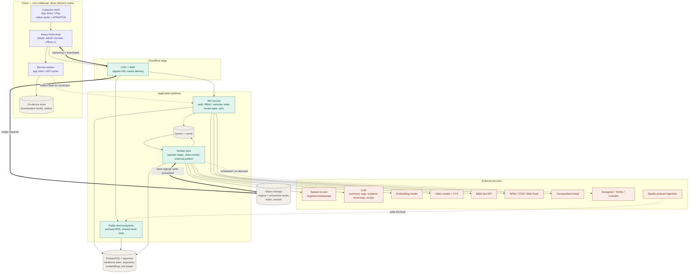

# Teaching Hub — Architecture (north star)

> Phase 2 artefact. This is a direction, not a contract: it exists so that every feature in
> [prd.md](prd.md#L1) has a home and so the choices that are expensive to unwind are made
> deliberately. Later slices will diverge from it — that is expected. Divergence from anything
> marked **Expensive to reverse** should be a conscious decision, not a drift.

## Overview

Teaching Hub is one TypeScript codebase deployed as three runtime roles — a client, an API, and a
worker pool — over a shared Postgres and an object store. The client is a React PWA that is also
packaged, unchanged, into the two app stores; it holds its own copy of downloaded media and of any
writes made while offline. The API owns every piece of member state and every access-control
decision, and is the only thing that talks to the database. The workers own the entire asynchronous
pipeline: an uploaded recording is cleaned, transcribed, fanned out into summary, tags, scripture
references and mind map, embedded segment by segment, and cross-referenced against the existing
library — all as drafts that wait behind an admin review gate.

The single structural idea worth holding onto: **the timestamped transcript segment is the atom of
this system.** Search results, cross-references, mind-map nodes, video scripts, Flow Tracker
recommendations and note anchors are all the same thing viewed differently — a `(recording,
start_ms, end_ms)` tuple with text and an embedding attached. That is why there is one vector index
rather than a search subsystem and a separate recommendation subsystem, and why
[3.9](prd.md#L179) is correctly described in the PRD as infrastructure rather than a feature.

Everything expensive and slow (audio processing, ASR, LLM calls, embedding, video rendering,
external publishing) is a discrete, individually re-runnable job. Nothing in a request path waits on
a model.

## System diagram

**What the diagram proves:** no external AI service and no heavy media path ever sits inside a
member request. Members touch only the CDN and the API; every model call lives behind the queue in
the worker pool, and the bulk audio bytes bypass the application entirely. That is what makes
"a failure in AI generation never blocks listening" ([§6](prd.md#L724)) structural rather than
aspirational — and it is also why the one unauthenticated surface in the product (`Feed`, serving
the podcast RSS at [5.3.1](prd.md#L718) and the shared mind map at
[3.8.13](prd.md#L177)) is drawn as its own component rather than as a route on the API.

## Components & responsibilities

### Client — PWA shell

Owns rendering, the player, the offline cache and the outbox. Delivered three ways from one build
([5.2.2](prd.md#L706)): a browser PWA, an iOS App Store build, a Play build.

- **Owns:** playback UI and speed/position state locally, the download queue and progress
  ([3.18.7](prd.md#L406)–[3.18.9](prd.md#L408)), the offline write outbox
  ([3.18.14](prd.md#L419)–[3.18.15](prd.md#L420)), optimistic UI.
- **Does not own:** any authorisation decision. The client hides what a role cannot do; the API is
  what actually refuses it ([3.1.5](prd.md#L47)).
- The **Capacitor shell** contributes exactly three things the browser cannot reliably give us:
  native background audio with lock-screen transport ([3.2.6](prd.md#L67)), APNs/FCM push in a
  store build ([5.2.5](prd.md#L709)), and a filesystem for downloads that the OS will not evict
  under storage pressure ([3.18](prd.md#L391)). It contains no product logic.

### API service

The single writer to Postgres and the single place access control is decided.

- **Owns:** authentication and sessions, role enforcement, all member state (progress, notes,
  questionnaire responses, Flow Tracker sessions, Highlights, notification preferences), the
  publish/review gate ([4.17.3](prd.md#L683)), signed-URL minting for media, search query
  execution, the offline sync endpoint, and notification fan-out.
- **Does not own:** any long-running work. Anything that could take more than a second is enqueued.
- Exposed as a versioned JSON HTTP API — the API-first requirement in [§6](prd.md#L724) is what
  makes the store builds, the browser PWA and the admin console the same client against the same
  contract.

### Feed service

A deliberately tiny, unauthenticated read-only surface. Serves the per-series podcast RSS feed and
signed audio enclosures for [5.3.1](prd.md#L718), and the single shared-mind-map route at
[3.8.13](prd.md#L177). It is separate from the API so that "everything requires auth"
([3.1.2](prd.md#L44)) stays true of the API by construction, and the exceptions live in one
auditable place.

### Worker pool

Executes every pipeline step as an independent, idempotent, retryable job against a job ledger in
Postgres.

- **Owns:** audio processing, transcription, the derived-artefact fan-out, embedding and
  cross-reference computation, video rendering, external publishing, back-catalogue batches.
- **Does not own:** the decision to publish. Workers only ever produce drafts
  ([3.21.2.2](prd.md#L484)).
- Each step is separately addressable so an admin can re-run one step without the pipeline
  ([3.21.2.4](prd.md#L486)), and a failure halts that recording's chain and raises a flag
  rather than continuing on bad input ([3.21.2.3](prd.md#L485), [3.5.8](prd.md#L119)).

### Media store

Object storage holding original uploads ([3.4.9](prd.md#L102)), processed renditions, generated
video, and artwork. Never publicly addressable; every read is a short-lived signed URL issued by the
API after an authorisation check ([§6](prd.md#L724) Security).

### Primary datastore

Postgres holds relational state, transcript segments, and their embeddings in the same database via
pgvector. See **Key technology choices** for why these are not two systems.

## Data model

Conceptual only — [§4](prd.md#L497) already defines the fields; this is how the entities relate.

**The spine.** `Series 1—* Recording 1—1 Transcript 1—* Segment`. A recording belongs to at most one
series ([3.3.2](prd.md#L79)) and can exist without one ([3.3.9](prd.md#L86)). Every
`Segment` carries `start_ms`, `end_ms`, text and an embedding vector. `Recording` carries two media
pointers, original and processed ([4.2](prd.md#L513)), plus a `PipelineRun` with per-step status.

**Derived artefacts** all hang off the recording and all carry a `status` of draft/published plus
provenance — which model produced it and whether an admin changed it ([4.17.5](prd.md#L685)):
`Summary` (one per recording), `ScriptureReference` (structured book/chapter/verse, never free text —
[3.7.3](prd.md#L148)), `Tag` applied through a shared taxonomy across recordings and videos
([4.7](prd.md#L568)), `MindMap`, and `Video` with a parent recording.

**Cross-references** are a derived edge table over segment pairs — `(segment_a, segment_b, score,
basis)` where basis is embedding similarity, shared tag, or shared scripture citation
([3.9.3](prd.md#L187)). It is a cache of the vector index, not a source of truth, and can be
dropped and rebuilt.

**Member-owned state** is a separate cluster, all keyed by user and all subject to the privacy rule:
`PlaybackProgress`, `ListeningHistory`, `Note` (with `visibility`, an optional `parent_note` one
level deep, and reactions), `QuestionnaireResponse`, `FlowTrackerSession`, `HighlightEntry`,
`PersonalMindMap`, `NotificationPreference`. Account deletion removes this cluster and re-attributes
only public notes to a placeholder ([3.1.9](prd.md#L51)–[3.1.10](prd.md#L52)) — which
means public notes must not be foreign-keyed to users with `ON DELETE CASCADE`; that is a schema
decision the PRD forces.

**Community state** — `SosSignal` with acknowledgements and replies, and `Notification` rows fanned
out per recipient.

**The one thing worth calling out:** `Highlight`, `Note`, `CrossReference`, `SearchResult`,
`MindMapNode` and `FlowTrackerRecommendation` all ultimately resolve to a recording plus an offset.
Modelling that offset consistently — a nullable `(recording_id, timestamp_ms)` pair on each — is what
lets "open at the moment" work identically from six different features
([3.9.5](prd.md#L189), [3.10.7](prd.md#L206), [3.14.7](prd.md#L312),
[3.15.7](prd.md#L330), [3.12.12](prd.md#L274), [3.8.4](prd.md#L165)).

## Key technology choices

| Choice | Why | Reversal cost |
| :---- | :---- | :---- |
| **TypeScript end to end, monorepo** | One language across client, API and workers means the domain types — segment, pipeline status, role — are defined once and shared, which is what keeps the API-first contract in [§6](prd.md#L724) honest instead of hand-maintained. | Low early, high later |
| **React PWA (Next.js App Router) as the only UI codebase** | [5.2.2](prd.md#L706) is explicit that a feature never exists in one delivery route and not another. One codebase is the mechanism, not a preference. | **Expensive to reverse** |
| **Capacitor for store packaging** | Wraps the same web build, and specifically buys the three capabilities the PRD flags as risky: iOS push in a store build, reliable background audio, and non-evictable download storage. The alternative — pure web PWA — leaves [3.17.1](prd.md#L367) and [3.18.6](prd.md#L405) exposed to Safari's limits. | Moderate |
| **PostgreSQL + pgvector as the single datastore** | The decisive constraint is [3.10.9](prd.md#L208): search must return published content *plus the searching member's own private notes and personal mind maps*, and never anyone else's. A separate vector service means either replicating the permission model into it or post-filtering results (which breaks top-k). Keeping vectors in the same database as the ACL data makes that a `WHERE` clause. At this corpus size — roughly 200k–250k segments after the back catalogue and several years of weekly teaching — a single Postgres with an HNSW index is comfortably within range. | **Expensive to reverse** |
| **Hybrid search: pgvector ANN + Postgres full-text, fused** | [3.10.2](prd.md#L201) wants meaning; [3.10.5](prd.md#L204) wants an exact scripture citation to work. Those are different retrieval modes and one index does not serve both well. Fusing two rankings from one database is cheaper than running two systems. | Low |
| **Object storage with zero-egress pricing (R2 or equivalent), CDN in front** | Storage is permanent and unbounded by requirement ([§6](prd.md#L724)), and audio streaming is the highest-volume path in the product. Egress-priced storage makes the one thing members do most the thing that scales worst. | Moderate |
| **Durable job queue with a Postgres-backed job ledger (Redis/BullMQ for dispatch)** | [3.21.2.4](prd.md#L486) requires re-running one step of a pipeline, and [3.19.4](prd.md#L432) requires showing an admin exactly where each recording sits. Both need pipeline state to be queryable data, not queue internals — so the ledger lives in Postgres and the queue is only a dispatcher. | Low |
| **FFmpeg for the sound profile** (`afftdn` denoise → clarity EQ/compression → `loudnorm` two-pass to a fixed LUFS target) | [3.4.5](prd.md#L98) asks for one named profile applied library-wide, and [3.4.6](prd.md#L99) asks to preview it before saving. A parameterised FFmpeg filter chain stored as a versioned row gives both, and re-processing is just re-running it. Loudness normalisation to a broadcast target also satisfies [3.4.10](prd.md#L103) — podcast platforms expect it. | Low |
| **Managed ASR with segment timestamps, behind an adapter** | [3.5.2](prd.md#L113) is the hinge of the product and [§7](prd.md#L742) names accuracy on ministry-specific vocabulary as a real risk. An adapter interface means the provider can be swapped, or a custom-vocabulary provider adopted, without touching anything downstream. | Low — deliberately |
| **Claude (Anthropic API) for all text generation** | Summary, description, tags, scripture identification, mind-map extraction and video script segmentation are one capability used six ways ([3.6](prd.md#L121), [3.7.1](prd.md#L146), [3.8.1](prd.md#L162), [3.11.3.1](prd.md#L233), [4.17.1](prd.md#L681)). Long context matters: a 90-minute transcript is fed whole rather than chunked, which is what keeps a summary faithful to the teaching. | Low |
| **Template-based video rendering (Remotion-style) + TTS, with a generative backend behind the same interface** | [3.11.2.1](prd.md#L226) describes presets as detailed descriptions of a visual treatment, and [3.11.2.3](prd.md#L228) wants consistency across the catalogue — both of which argue for deterministic templates over per-generation model output. [§7](prd.md#L742) independently flags generative video as the least proven, most expensive capability. Making the renderer an interface means the cheap path ships and the expensive path is an upgrade, not a rewrite. See the cost table — this is the decision with the largest financial swing in the architecture. | Low (by design) |
| **Self-hosted email/password auth with server-side role checks** | No self-signup, no social login, no SSO, ~100–1,000 users, and an invitation flow ([3.1.3](prd.md#L45)) that a third-party identity provider would only complicate. Roles live in our database because every permission check also needs product context. | Moderate |
| **Structured citations + verse text fetched and cached from a Bible text API** | [3.7.3](prd.md#L148) mandates structured storage regardless. Keeping verse *text* as a cache rather than as data means the licensing answer ([§7](prd.md#L742)) changes one component instead of the schema — worst case, [3.7.4](prd.md#L149) degrades to a link out. | Low — deliberately |
| **Podcast distribution as a self-hosted RSS feed** | Spotify has no push ingestion API; it polls a feed. So [3.20.4](prd.md#L451) is architecturally a per-recording `include_in_feed` flag plus feed regeneration, not an outbound API call. Worth naming now, because the admin UI in [3.20.6](prd.md#L453) should not promise a per-episode delivery status that no upstream provides. | Low |

## Boundaries & integration

**Client ↔ API.** Versioned JSON over HTTPS. Session via HTTP-only cookie on web, secure native
storage under Capacitor; the API accepts both against one session model. Every response is shaped by
the caller's role — the API never returns a draft to a Member and never returns another member's
private content to anyone ([3.10.9](prd.md#L208), [3.13.8](prd.md#L294),
[3.14.8](prd.md#L313), [3.15.9](prd.md#L332)).

**Client ↔ media.** The client asks the API for a playable URL; the API authorises, then mints a
short-lived signed CDN URL. Bytes never pass through the API. Downloads use the same route and land
in on-device storage.

**Offline sync.** The client keeps an append-only outbox of writes made while disconnected — progress
positions, notes, questionnaire answers, Flow Tracker responses — each with a client-generated id and
a local timestamp. On reconnect the outbox is flushed to a single sync endpoint. Conflict policy is
per-entity and deliberately simple: playback progress is last-write-wins on the furthest position,
notes and responses are append/update by owner (single-writer by definition, so genuine conflicts are
rare), and server-side deletions win — which is how [3.18.12](prd.md#L414) removes an unpublished
recording from a device. The reverse direction is a delta manifest the client pulls on reconnect,
listing what has been added, changed or revoked since its last sync token.

**API ↔ workers.** One direction only: the API enqueues, workers write results back as drafts. Workers
never call the API. Job completion raises a domain event, which is what drives the notifications at
[3.17.10](prd.md#L361)–[3.17.12](prd.md#L361).

**Workers ↔ AI providers.** Every provider sits behind a narrow adapter — `transcribe`, `generate`,
`embed`, `synthesize`, `render` — with the model, version and prompt recorded on every output
([4.5](prd.md#L549) *Generated by*). That record is what makes regeneration
([3.6.9](prd.md#L135)) and provider migration tractable.

**Outbound publishing.** Each external platform is an adapter behind a common `publish(item, target)`
contract with its own queue and its own status per item ([3.20.7](prd.md#L454)). They differ
enough — Spotify pulls a feed, Instagram and LinkedIn take direct API posts, TikTok requires its
Content Posting flow — that a shared abstraction only covers queuing, retry and audit logging
([3.20.8](prd.md#L455)), not the mechanics. All are publish-only; nothing is read back
([5.3.5](prd.md#L722)).

**Cross-reference recomputation.** [3.9.6](prd.md#L190) says references are recomputed when a
recording joins the library. Recomputing all pairs is quadratic and unnecessary: embed the new
recording's segments, run top-k ANN against the existing index, and write edges in both directions.
Cost is linear in new content, and the existing library gains its links to the new arrival as a
side-effect of the same pass.

## Cross-cutting concerns

**Authorisation.** One policy layer in the API, consulted on every request, expressed as
`(actor, action, resource)`. Three roles ([3.1](prd.md#L31)) plus one invariant enforced at the
data layer rather than in policy: the last admin cannot be removed or demoted
([3.1.11](prd.md#L53)).

**The review gate.** Draft-versus-published is not a per-feature flag; it is one state machine shared
by summaries, scripture references, metadata, mind maps, recordings and videos. Every generated
artefact enters as draft, every transition to published is an authenticated admin action, and every
transition is logged. This is the mechanism behind [4.17.3](prd.md#L683) and
[3.21.2.2](prd.md#L484), and it is why [3.19.2](prd.md#L430)'s Pending Reviews queue is a
single query over one status column rather than a union of six.

**Privacy.** Private member content is enforced at the query layer, not filtered in the UI. Search in
particular ([3.10.9](prd.md#L208)) issues one query whose visibility predicate is `published OR
owner = :me`, which is only possible because vectors and ownership live in the same database.

**Errors and failure posture.** Two classes, handled differently. A *pipeline* failure halts that
recording, records the failing step and reason, and raises an admin flag
([3.4.11](prd.md#L104), [3.5.8](prd.md#L119), [3.19.4](prd.md#L432)) — it never
publishes partial results. A *request* failure returns a typed error the client can distinguish; the
distinction between "no results" and "search unavailable" at [3.10.11](prd.md#L210) is a
requirement that only works if error types are part of the API contract.

**Notifications.** One event model, two transports. A domain event produces `Notification` rows for
its audience (in-app centre, always) and, subject to per-category preference
([3.17.13](prd.md#L387)), a push payload dispatched via APNs/FCM in store builds and Web Push in
browsers. Preferences gate push only; the in-app centre receives everything, including muted
categories ([3.17.14](prd.md#L388)).

**Observability.** Structured logs with a correlation id spanning API request → job → provider call,
error tracking with alerting, and a pipeline dashboard fed from the job ledger rather than from logs
([3.19.4](prd.md#L432)). Provider spend is tracked per job, because [§7](prd.md#L742)
correctly identifies cost as an unknown that needs measuring, not estimating.

**Audit.** An append-only log for external publishes ([3.20.8](prd.md#L455)) and for admin
actions on member content ([3.12.10](prd.md#L272), [3.16.11](prd.md#L357)), carrying actor,
action, target and timestamp.

**Configuration.** Environment-injected secrets; product-level settings that admins change — the sound
profile ([3.4.6](prd.md#L99)), video style presets ([3.11.2.2](prd.md#L227)), question banks
([3.14.11](prd.md#L316)) — are versioned rows in the database, not deploys. That is what makes
[3.4.7](prd.md#L100) work: a recording records which profile version processed it, so changing
the profile cannot retroactively alter anything.

## Scalability & growth posture

**Built to stretch.** Content volume, not member count, is the growth axis: [§6](prd.md#L724)
says content grows unbounded while members go from 100 to 1,000+. Object storage and the CDN absorb
member growth with no architectural change. The worker pool scales horizontally and independently of
the API, which is what makes the back-catalogue burst ([3.21.3.3](prd.md#L492)) a
concurrency-limit setting rather than an event. The vector index grows with segments, and HNSW on
Postgres has substantial headroom above this corpus.

**Deliberately not built yet.** Single-region deployment — the audience is one group, and multi-region
buys latency nobody has asked for. Single primary database with read replicas available if needed but
not provisioned. No horizontal sharding, no CQRS, no event-sourcing: the read and write shapes here
are ordinary. No self-hosted models; every AI capability is a paid API behind an adapter, which trades
per-unit cost for the ability to change provider in a day. No real-time transport — notes and SOS
signals refresh on poll and on push, not over a socket; if the SOS channel ([3.16](prd.md#L334))
turns out to need live presence, that is a bounded addition.

**Where it will bend first.** Two places. Vector search latency once segments pass roughly a million
rows, which would push the index to a dedicated vector store or to partitioning by series — a change
whose cost is entirely the permission-model replication described above. And video rendering, which is
CPU-bound and bursty and will want its own scale-to-zero pool before anything else does.

## Estimated running costs

Launch = 100 members, ~4.3 recordings/month at ~90 min each, ~8 reels + 2 summary videos/month, ~4 hrs
listening per member per month. Target = 1,000 members at the same publishing cadence and ~4× the video
output. Excludes the one-time back-catalogue run, listed separately.

| Item | Usage assumption | Launch / month | Target / month |
| :---- | :---- | :---- | :---- |
| API + feed hosting | 2 small always-on instances | $25 | $50 |
| Worker pool | ~40 machine-hrs launch, ~120 target; scale-to-zero between jobs | $20 | $60 |
| PostgreSQL + pgvector | ~90k segments launch → ~250k target; managed, with backups | $19 | $69 |
| Redis (queue + cache) | ~1–4 M commands/month | $10 | $25 |
| Object storage | ~95 GB after back catalogue, +~1.4 GB/month; zero-egress tier | $2 | $6 |
| Media egress | ~11 GB/month launch → ~130 GB/month target (streaming + downloads) | $0 | $0 |
| Transcription | 6.5 hrs of audio/month @ ~$0.26/hr | $2 | $2 |
| LLM generation | 4.3 recordings/month × ~80k input tokens across 5 passes, plus regenerations | $2 | $3 |
| Embeddings | 4.3 recordings/month × ~16k tokens, plus query embeddings | <$1 | $1 |
| **Video generation — template path** | 10 videos/month: render compute + TTS @ ~$0.15 each | **$2** | **$6** |
| **Video generation — generative path** | 10 videos/month × 45s, ~2 takes each at $0.10–0.50/generated second | **$80–360** | **$320–1,440** |
| Text-to-speech | ~1,500 words/month of AI voiceover | <$1 | $2 |
| Bible text API | ~500 verse lookups/month, cached | $0 | $0–10 |
| Transactional email | Invitations and password resets only — a few dozen/month | $0 | $15 |
| Error tracking + logs | Single project, moderate volume | $0 | $26 |
| Push (APNs / FCM / Web Push) | All notification volume | $0 | $0 |
| CDN + DNS | ~130 GB/month peak, standard tier | $0 | $5 |
| **Total — template video path** | | **~$85** | **~$270** |
| **Total — generative video path** | | **~$165–445** | **~$585–1,700** |

**One-time costs**

| Item | Assumption | Cost |
| :---- | :---- | :---- |
| Back-catalogue transcription | ~300 recordings × ~1.5 hrs = 450 hrs @ ~$0.26/hr | ~$120 |
| Back-catalogue LLM fan-out | 300 recordings × 5 passes | ~$110 |
| Back-catalogue embedding | ~5 M tokens | <$5 |
| Back-catalogue audio processing | ~45 worker-hrs of FFmpeg | ~$25 |
| Apple Developer Program | Annual, not monthly | $99/yr |
| Google Play developer account | One-time | $25 |

**The line that dominates, and the decision it forces.** Every line in this table except one is
essentially flat between 100 and 1,000 members — this product's infrastructure cost is driven by
content volume, and content volume is set by a weekly cadence, not by audience. The exception is video
generation, which is 2% of the bill on the template path and 60–85% of it on the generative path, and
which scales with publishing cadence rather than membership. If the generative path is chosen, video
becomes the single largest operating expense at every scale, and the approve-or-discard workflow at
[3.11.4.6](prd.md#L246) — which bins a full-cost generation on rejection — becomes an expensive
design. That is why the renderer is specified as an interface with the template path as the default:
the choice can be deferred and measured on real output rather than committed to now. It is worth
deciding before [3.11](prd.md#L212) is scheduled into a slice, because it also determines whether
style presets are template definitions or model prompts — and those are different artefacts.

## Open questions carried forward

Points where the PRD resisted a clean architectural home. None blocks progress; each wants a decision
before the relevant slice.

1. **Flow Tracker gap detection vs. "never scored"** ([3.14.6](prd.md#L311) against
   [3.14.9](prd.md#L314)). Detecting that a response "indicates a gap in understanding" requires
   evaluating a free-text answer — mechanically an assessment, even though the output is a reading
   list and no score is ever shown. The architecture models it as a private LLM judgment producing
   only recommendations, with the evaluation never persisted as a rating. Worth confirming that is the
   intended reading.
2. **Spotify per-episode publishing** ([3.20.4](prd.md#L451), [3.20.7](prd.md#L454)). No
   upstream API exists to publish or confirm an individual episode; Spotify polls the feed on its own
   schedule. Per-episode status can therefore only ever be "included in feed" and "seen in feed on
   last check" — not "delivered". The admin UI should not imply more.
3. **Social publishing prerequisites** ([3.20.3](prd.md#L450)). Instagram, TikTok and LinkedIn
   posting all require business accounts and platform app review before any code runs. That is lead
   time, not build time, and it should start well ahead of the slice that needs it.
4. **Bible text licensing** ([3.7.4](prd.md#L149)). Determines whether verses render inline or
   link out. The architecture is indifferent — citations are structured either way — but the member
   experience is not.
5. **Two processed renditions, not one** ([3.4.10](prd.md#L103)). One processed master, but
   streaming wants a small mono AAC and podcast feeds broadly expect MP3. Treated here as two
   renditions from one processing run, which is a small addition to [4.2](prd.md#L513)'s
   *Processed audio* field.
6. **Download ceiling** ([3.18.6](prd.md#L405)). Capacitor's native filesystem removes the
   browser eviction risk in store builds but not on the browser-delivered PWA, where "Download all"
   for a long series can still exceed the available quota. The browser route needs a stated cap and a
   clear message; the product does not currently describe one.
