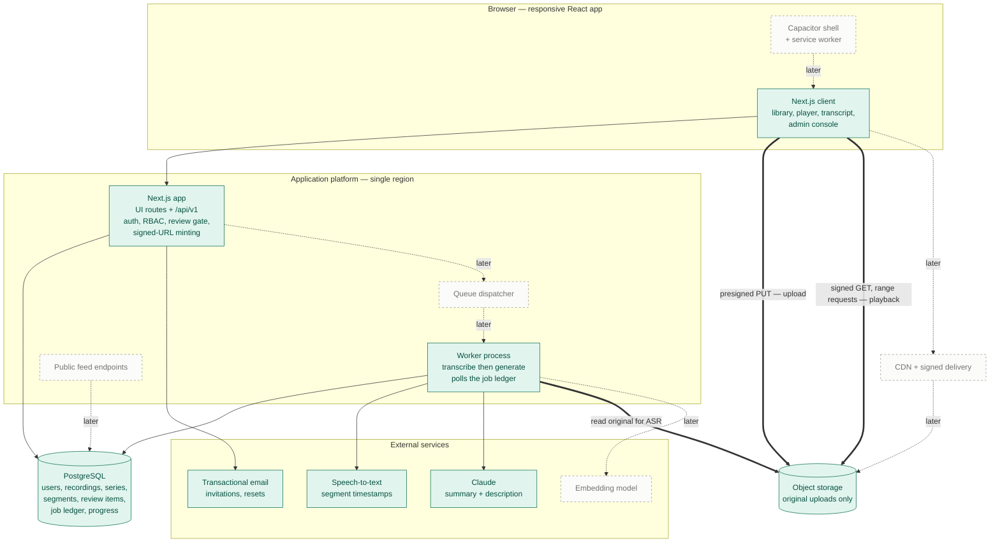

# Teaching Hub — Slice 01 architecture: core-listening

> Phase 4 artefact. The architecture for **this slice only** — deliberately smaller than
> [architecture.md](architecture.md#L1). Where it knowingly differs from the north star, that is
> named in **Divergence from the north star** rather than left to be discovered during the build.

## Overview

Two deploy units over one Postgres and one object store — and, per
[architecture.md § Estimated running costs](architecture.md#L343), all three run on a single host.
The units stay separate processes with the boundaries below; co-location is a deployment fact, not a
structural one.

A **Next.js App Router application** serves the React client *and*, as route handlers under a
versioned `/api/v1` prefix, the API — the single writer to Postgres and the single place any
authorisation decision is made. A **worker process** runs the pipeline: it polls a job ledger in
Postgres, calls a managed ASR provider through a `transcribe` adapter, then calls Claude through a
`generate` adapter, and writes both results back as drafts. Audio bytes never pass through either
process: the browser uploads straight to object storage on a presigned PUT, and plays back from a
short-lived signed URL the API mints after an authorisation check.

Three structures are built now because retrofitting any of them costs most of the codebase
([slice-prd.md § Rationale](slice-prd.md#L241)): the **timestamped segment** as the atom
([3.5.2](prd.md#L113)), the **review gate** as one status column with one queue query
([4.17.3](prd.md#L683)), and **authorisation server-side per request** ([3.1.5](prd.md#L47)).

Everything else is stripped. There is no Redis, no CDN, no service worker, no Capacitor shell, no
Feed service, no vector index, and no audio processing step. Each is a marked seam, not a missing
piece.

## Builds on

Nothing — this is the first slice. `docs/completed-slices/` is empty and the repository holds no
application code, so there are no extension points to land on and no existing structure to change.
Every component below is new, which is why **Changes to existing structure** is empty and the slice
diagram has no *untouched* nodes.

The consequence worth stating: this slice is the one that *creates* the extension points every
later slice will read. That is what the **Extension points** section is for, and it is the section
slice 02's step 2 will open first.

## Slice diagram

**Legend.** Green = **adds**, new in this slice. Orange = **changes**, existing structure reshaped
here — *empty this slice*. Grey = **untouched**, already running — *empty this slice, nothing runs
yet*. Dashed = **deferred**, seams drawn so it stays obvious they are not being built.

**What it proves: restraint.** Eight live boxes against the north star's nineteen. No queue broker,
no CDN, no vector index, no second UI delivery route, and three external services instead of nine.
The one property the north star calls structural is nonetheless already true here — every model
call sits behind the ledger in the worker, and the audio bytes bypass the application entirely, so
*"a failure in AI generation never blocks listening"* ([§6](prd.md#L724)) holds from day one rather
than being retrofitted.

## Components for the slice

### Next.js application — client half

The responsive React UI from one codebase ([slice-prd.md § In scope → 8](slice-prd.md#L161)),
covering the member surface (library, series view, recording page, player, follow-along transcript)
and the admin console (upload, Pending Reviews, pipeline status, series management, user
management).

- **Owns:** rendering, the `<audio>` element and its transport, the transcript-follows-playback
  binding, optimistic UI, and the local copy of playback speed and position before they are synced.
- **Does not own:** any authorisation decision ([architecture.md § Client — PWA
  shell](architecture.md#L111)). It hides what a Member cannot do; the API is what refuses it.
- **Not yet:** no service worker, no web app manifest, no offline cache, no Capacitor. Responsive
  only — the installable-PWA row of [§5.1](prd.md#L689) is deferred with offline.

### Next.js application — API half

Route handlers under `/api/v1`, consumed by the client strictly over HTTP. The single writer to
Postgres and the single place `(actor, action, resource)` is evaluated.

- **Owns:** sessions and password hashing, invitation issue/accept/revoke/resend, role enforcement
  on every request ([3.1.5](prd.md#L47)), the last-admin invariant ([3.1.11](prd.md#L53)), upload
  finalisation, review-gate transitions, publish/unpublish, series CRUD, transcript segment
  correction, playback progress, and signed-URL minting for media.
- **Does not own:** anything that could take more than a second. Transcription and generation are
  enqueued to the ledger and returned from immediately.
- **The contract is the boundary, not the process.** The client imports no server module and holds
  no database access; it calls an absolute API origin. That is the whole of what
  [5.2.2](prd.md#L706) needs from this slice, and it is what makes the Capacitor build later the
  same client against the same contract.

### Worker process

A separate Node process running the pipeline as independent, idempotent, individually re-runnable
jobs against the ledger ([architecture.md § Worker pool](architecture.md#L147)).

- **Steps in this slice, in order:** `transcribe` → `generate_draft`. That is it.
- `transcribe` reads the original object, calls the ASR adapter, writes `transcript` + `segment`
  rows with `start_ms`/`end_ms` and the detected language ([3.5.2](prd.md#L113),
  [3.5.7](prd.md#L118)).
- `generate_draft` feeds the whole transcript to Claude in one call and writes **two** review items
  — one `summary` ([3.6.1](prd.md#L127)), one `recording_metadata` carrying the suggested
  description ([4.17.1](prd.md#L681)) — each recording the model, model version and prompt version
  that produced it ([4.17.5](prd.md#L685)).
- **Owns no publish decision.** Workers only ever produce drafts ([3.21.2.2](prd.md#L484)).
- **Chain semantics:** a step enqueues its successor only on success. A failure records the failing
  step and reason and stops there ([3.21.2.3](prd.md#L485), [3.5.8](prd.md#L119)); an admin can
  enqueue any single step again without re-running the chain ([3.21.2.4](prd.md#L486)).

### Job ledger (in Postgres, not a broker)

A `job` table polled with `FOR UPDATE SKIP LOCKED`. It is both the dispatch mechanism and the
queryable pipeline state the admin dashboard reads ([3.19.4](prd.md#L432)) — which is the property
[architecture.md § Key technology choices](architecture.md#L209) asks for; the north star simply
also has Redis in front of it. See **Divergence**.

### Media store

Object storage on a zero-egress tier, holding **original uploads only** — no processed rendition
exists yet ([slice-prd.md § In scope → 2](slice-prd.md#L52)). Never publicly addressable. Upload is
a presigned PUT issued to an authenticated admin; playback is a short-lived signed GET the API
mints after checking the recording is published and the caller is authenticated
([§6](prd.md#L724) Security). Range requests come from the object store directly, which is what
makes scrubbing ([3.2.9](prd.md#L70)) work without a CDN.

**The one non-negotiable** ([slice-prd.md § Rationale](slice-prd.md#L241)): the original object is
never overwritten or deleted. It is the input [§3.4](prd.md#L88) will read, and re-transcription
after processing lands depends on it ([3.4.9](prd.md#L102)).

### Primary datastore

A single self-hosted PostgreSQL on the application host. **pgvector is not enabled and no embedding
column exists** — but the `vector` extension must be *installed and available*, because
[architecture.md § Key technology choices](architecture.md#L209) marks the single-datastore decision
*expensive to reverse* and the whole reason it is right is that vectors and ACL data share a
database. Self-hosting makes that availability something we install rather than something we have to
pick a provider for. The cost it carries instead is backups, which are a `pgBackRest` archive to the
object store, proven by a restore — [implementation-plan.md § Step 21](implementation-plan.md#L331)
owns that, along with the rest of the deployment.

## Changes to existing structure

**None — nothing is running yet.** This section exists in the template because from slice 02 on it
is where the regressions live; for slice 01 an empty answer is the correct one.

## Data model (slice)

Conceptual; [§4](prd.md#L497) already defines the fields. **Every entity here is new.**

**The spine** — `Series 1—* Recording 1—1 Transcript 1—* Segment`, exactly as [architecture.md §
Data model](architecture.md#L171) draws it. A recording belongs to at most one series
([3.3.2](prd.md#L79)) and may have none ([3.3.9](prd.md#L86)). `Segment` carries `start_ms`,
`end_ms`, `text`, and who corrected it when ([3.5.5](prd.md#L116)) — **no embedding column.**
`Recording` carries `original_media_key`, `title`, `recorded_at`, `published_at` (nullable —
unpublish clears it without deleting, [3.2.11](prd.md#L72)), and `description`.

*Deliberately shaped for later:* `Recording` has room for a second media pointer
([4.2](prd.md#L513) *Processed audio*) but does not have the column yet — adding it is what
[§3.4](prd.md#L88) does.

**The review gate** — one `review_item` table, not one table per artefact:
`(id, recording_id, kind, status, fields, provenance, created_at, reviewed_by, reviewed_at)`.

- `kind` in this slice is `summary` or `recording_metadata`; later artefacts add a value, not a
  table.
- `status` is `draft | published | discarded`. **Pending Reviews is one query over this one column**
  ([3.19.2](prd.md#L430)) — which is precisely the property [architecture.md § Cross-cutting
  concerns](architecture.md#L271) says must not degrade into a union of six.
- `fields` holds the per-field values and `provenance` holds, per field, that it was AI-suggested
  and whether an admin changed it ([4.17.5](prd.md#L685)) — which is what makes per-field
  accept/edit/discard ([4.17.2](prd.md#L682)) a form over one row rather than a column per field
  per artefact.
- Approving writes through to the canonical entity (`summary.content`, `recording.description`) and
  closes the item; regenerating ([3.6.9](prd.md#L135)) discards the current draft and enqueues
  `generate_draft` for that kind with the optional steering prompt attached.
- Every transition is logged with actor, action, target and timestamp.

**Pipeline state** — `job (id, recording_id, step, status, attempt, error, enqueued_at, started_at,
finished_at, provider_meta)`. `provider_meta` carries model, version and spend per job, because
[§7](prd.md#L742) wants cost measured rather than estimated.

**Accounts** — `user (email, password_hash, display_name, role, deactivated_at,
preferred_playback_speed)` and `invitation (email, role, token_hash, expires_at, revoked_at,
accepted_at)`. Role is `admin | member`; **`contributor` is deliberately absent from the enum**, and
adding it is a one-value migration plus four policy cases ([slice-prd.md § Still
remaining](slice-prd.md#L171)). No avatar. Playback speed lives on the user because
[3.2.4](prd.md#L65) persists it across recordings, not per recording.

> **Amended in step 2** — one table added. `session (id, user_id, token_hash, created_at,
> last_used_at, expires_at, revoked_at)`. Sessions are **server-side records, not signed stateless
> tokens**: the cookie carries an opaque random token and only its hash is stored. That is what
> makes sign-out real rather than a request that the browser forget something, and what lets step
> 4's deactivation ([3.1.7](prd.md#L49)) end a session that is already open instead of waiting for
> an expiry. A stateless token makes both unbuildable without a revocation list, which is this table
> with extra steps.
>
> Uniqueness on `user.email` is enforced at the database on `lower(email)`, so two accounts
> differing only in case are impossible however the row was written.

**Member-owned state** — exactly one entity: `playback_progress (user_id, recording_id,
position_ms, updated_at)`, primary-keyed on the pair, last-write-wins on the furthest position
([3.2.5](prd.md#L66)). No listening history, no completed marker, no notes, no highlights — all
deferred ([slice-prd.md § In scope → 5](slice-prd.md#L117)).

**Not modelled at all:** cross-reference edges, tags, scripture references, mind maps, videos,
questionnaires, Flow Tracker sessions, SOS signals, notifications, notification preferences.

## Key choices

| Choice | Why, for this slice | Relation to the north star |
| :---- | :---- | :---- |
| **TypeScript monorepo; domain types shared between client, API and worker** | The segment shape, the pipeline step enum and the role enum are defined once. That is what keeps the API-first contract honest instead of hand-maintained. | Matches [architecture.md § Key technology choices](architecture.md#L209) directly. |
| **Next.js App Router, one codebase for UI and API** | The UI codebase choice is marked *expensive to reverse*, so it is taken as given. Serving `/api/v1` from the same app removes a deploy unit without touching the contract. | Matches on the UI; consolidates the deployment — see **Divergence**. |
| **Postgres job ledger polled with `SKIP LOCKED`; no broker** | Two steps, ~4.3 recordings/month, seconds of dispatch latency is invisible. The ledger has to be in Postgres regardless, because [3.19.4](prd.md#L432) and [3.21.2.4](prd.md#L486) need pipeline state to be queryable data. Adding a broker now would add infrastructure that only changes *dispatch*. | Matches — the north star makes the ledger itself the queue for the same reason, and names no broker. |
| **Presigned direct-to-object-store upload and playback; no CDN** | Keeps bulk audio out of the application in both directions, which is the boundary that actually matters. Range requests from the object store give scrubbing for free. At ~11 GB/month a CDN buys latency nobody has complained about. | Keeps the zero-egress storage decision, which is the part with real reversal cost; defers the edge. |
| **One `review_item` table with a `kind`, built generically for two kinds** | The only structure in this slice built past its immediate need, and it earns it: [slice-prd.md § Rationale](slice-prd.md#L241) names publishing-without-a-review-gate as one of three things that would make this slice throwaway, and the north star's single-query Pending Reviews only survives if kinds 3–6 are rows. | Matches [architecture.md § Cross-cutting concerns](architecture.md#L271). |
| **Managed ASR behind a `transcribe` adapter; Claude behind a `generate` adapter** | Both providers are named in [§7](prd.md#L742) as accuracy and cost risks. Two narrow interfaces cost almost nothing now and are what make provider swap and regeneration tractable. Model, version and prompt version are recorded on every output. | Matches exactly, including the deliberate low reversal cost. |
| **Whole transcript in one LLM call, producing summary and description together** | A 90-minute transcript fits in long context, which is why the north star picked Claude. One call for both artefacts halves the cost and keeps them consistent with each other. | Matches. |
| **Self-hosted email/password, HTTP-only cookie session, roles in our database** | No self-signup, invitation-only, ~100 users. A third-party IdP would complicate [3.1.3](prd.md#L45) and still leave the product-context permission checks with us. | Matches. |
| **Single self-hosted Postgres on the application host, single region, no read replica** | 100 members, one group, one publishing cadence. Co-locating it with the app is what makes the launch bill ~$20 rather than ~$85; the price is that backups and patching become ours. | Matches [architecture.md § Scalability](architecture.md#L317) "deliberately not built yet" and the topology in [§ Estimated running costs](architecture.md#L343). |
| **Correlation id spanning API request → job → provider call, plus error tracking** | Cheap now, and a pipeline that fails silently in slice 01 is a pipeline nobody trusts by slice 03. The dashboard reads the ledger, not the logs. | Matches [architecture.md § Cross-cutting concerns](architecture.md#L271). |

**Two inputs this slice needs and nothing defines** — carried from [slice-prd.md § Duplicate &
reference audit](slice-prd.md#L289). Neither blocks starting; both are settled here so the build is
not ambiguous, and both are cheap to change *before* implementation and annoying after:

1. **Invitation validity window** ([3.1.4](prd.md#L46) says only "a fixed window"). **Assumed: 7
   days**, with resend issuing a fresh token and revoking the old one.
2. **Accepted audio formats and maximum upload size** ([3.2.1](prd.md#L62) says only "the common
   formats produced by consumer and semi-professional capture equipment"). **Set by the operator:
   200 MB ceiling**; accepted formats mp3, m4a/aac, wav, flac. This determines both the
   presigned-upload validation and what the ASR adapter must accept or reject. The ceiling is
   checked client-side *before* the presigned PUT is requested, so an oversized file fails
   immediately rather than after a long upload, and re-checked server-side at finalisation because
   the client holds no decision.

   **What 200 MB implies, stated so it is not discovered at the first upload.** A 90-minute
   teaching fits comfortably as mp3 or m4a at ordinary bitrates (~85 MB at 128 kbps, ~135 MB at 192
   kbps) but **does not fit as WAV or FLAC** — lossless at that length runs several hundred MB. So
   in practice the working path is a compressed export, and `wav`/`flac` are accepted only for
   shorter recordings. Two consequences worth carrying forward: the admin upload UI should say the
   limit and the reason up front rather than rejecting silently, and the retained original that
   [§3.4](prd.md#L88) will later denoise and loudness-normalise
   ([3.4.9](prd.md#L102)) will usually be lossy — which costs a little headroom in that
   processing pass, though not enough to change any decision in this slice.

## Divergence from the north star

Two, both *the slice bending*, neither touching anything [architecture.md](architecture.md#L1) marks
**expensive to reverse**.

> **One divergence was resolved rather than reversed.** This slice previously diverged by running
> the Postgres ledger as its own dispatcher against a north star that paired it with Redis/BullMQ.
> The north star has since adopted the same position — the ledger *is* the queue, no broker — so
> this is now a match and is recorded in **Key choices** above. Redis remains available behind the
> queue port when a step becomes latency-sensitive or the back-catalogue burst
> ([3.21.3.3](prd.md#L492)) needs real concurrency control.

1. **The API is deployed inside the Next.js app rather than as its own service.** The *contract* is
   intact — versioned JSON, absolute origin, no server imports in the client — so the store-build
   requirement at [5.2.2](prd.md#L706) is unaffected. What is deferred is the independent scaling
   the north star draws, which matters when the worker pool and the API want different shapes.
   Splitting later is a deploy change, not a code change, precisely because the boundary is honoured
   now.
2. **No CDN in front of object storage.** Signed URLs point at the object store directly. Adding the
   edge later moves where the URL is signed and nothing else.

Not divergence, just not-yet-built: the Feed service, pgvector, the service worker and the Capacitor
shell are all absent because the features that need them are out of scope, and the north star
already expects a slice to carry less than full scope.

**One product-level ordering the architecture cannot fix**, restated so it is not rediscovered
mid-build: [3.4.1](prd.md#L94)'s "processed before available for playback" does not hold in this
slice — members hear the raw upload ([slice-prd.md § In scope → 2](slice-prd.md#L52)).

## Extension points

The seams this slice leaves. **This is the section slice 02 reads first.**

| Seam | Where it is | How the deferred work attaches |
| :---- | :---- | :---- |
| **Pipeline step chain** | The ordered step list the worker walks, and the `step` column on `job` | [§3.4](prd.md#L88) inserts `process_audio` *before* `transcribe`; embeddings, scripture, tags and mind maps append after `generate_draft`. A new step is a list entry, a ledger value and a job handler. |
| **Second media pointer** | `Recording` has `original_media_key` and no processed pointer | [§3.4](prd.md#L88) adds `processed_media_key` (plural renditions per [architecture.md § Open questions](architecture.md#L414) item 5) and switches signed-URL minting to prefer it, falling back to the original — which is what lets the back-fill run recording by recording. |
| **Review-gate `kind`** | `review_item.kind` | Scripture references, tags, mind maps and video scripts each add a `kind` value and a generation step. The Pending Reviews query does not change. |
| **Segment row** | `segment` has no embedding column | [§3.9](prd.md#L179)/[§3.10](prd.md#L194) enable pgvector, `ALTER TABLE segment ADD embedding`, add an HNSW index, add an `embed` step, and add the `cross_reference` edge table over segment pairs. No re-transcription. |
| **`(recording_id, timestamp_ms)` offset** | Established by `segment` and `playback_progress` | Notes, highlights, mind-map nodes, search results and Flow Tracker recommendations all resolve through the same pair, which is what makes "open at the moment" one behaviour across six features ([architecture.md § Data model](architecture.md#L171)). |
| **Role enum + policy module** | `user.role` and the single `(actor, action, resource)` evaluation point | Contributor is one enum value plus four widened cases — upload ([3.2.1](prd.md#L62)), transcript correction ([3.5.5](prd.md#L116)), series management ([3.3.6](prd.md#L83)), dashboard gating ([3.19.1](prd.md#L429)). Cheap only because the check already exists server-side. |
| **Domain events at job completion and at publish** | Emitted and logged; nothing subscribes | [§3.17](prd.md#L361) fans out `Notification` rows per recipient from these exact events — publish, transcription failure, summary ready ([3.6.3](prd.md#L129)). |
| **Client-owned playback state** | Progress and speed are held client-side and pushed to a single-position endpoint | [§3.18](prd.md#L391) adds the append-only outbox and a batch sync endpoint alongside it, plus the delta manifest for the pull direction. An addition, not a rewrite, which is [slice-prd.md § Rationale](slice-prd.md#L241)'s stated check that this cut is not a dead end. |
| **Absolute API origin over a versioned contract** | The client's only route to data | [§5.2](prd.md#L701) wraps the same build in Capacitor; the service worker and manifest layer over the same contract. |
| **Queue port** | The interface the API enqueues through | Redis/BullMQ dispatch drops in behind it; the ledger and the dashboard query are untouched. |
| **Unauthenticated surface — no route carrying content** | The route wrapper's allowlist — an enumerated list, not a convention | Health is the single route outside [3.1.2](prd.md#L44), because it answers while the database is down and a session lookup then cannot. Step 2 ships the allowlist with a test asserting every route *not* on it refuses an anonymous request, which is what keeps this seam **checkable** rather than reviewed — and what makes adding a second public route a deliberate edit to a named list. [5.3.1](prd.md#L718)'s podcast RSS and [3.8.13](prd.md#L177)'s shared mind map still arrive as the separate Feed service, so the API itself grows no further public surface. (`/api/v1/diagnostics/*` are not an exception: they require a session like everything else, and `404` in a deployment.)  **Amended in step 2**, in two ways. (1) The heading said `GET /api/v1/health` *only*, which is not satisfiable: **the sign-in route cannot require a session**. The list ships with two entries — health and `POST /api/v1/auth/session` — and the property actually being protected is that no unauthenticated route carries content. Step 3 (invitation accept) and step 4 (password reset) each add one, and each addition is a deliberate edit to the named list. (2) The allowlist lives in the **route wrapper**, not a separate middleware: `apiRoute` takes access as a required first argument, so a route cannot be written without stating it, and a route declared public that is not on the list is refused anyway. A middleware could not have the first property. |

## Deliberately deferred

Not built, and not to be added by reflex. Each has a home above.

- **Redis / any message broker.** The ledger is the queue until dispatch latency or concurrency
  control actually demands otherwise.
- **CDN and edge caching.** Signed object-store URLs are enough at this volume.
- **pgvector, embeddings, HNSW index, cross-reference table.** No search or recommendation feature
  is in scope, and [slice-prd.md § Rationale](slice-prd.md#L241) is explicit that semantic search
  over five recordings is worse than scrolling.
- **Audio processing, the sound profile, FFmpeg, processed renditions.** The whole of
  [§3.4](prd.md#L88).
- **Service worker, web app manifest, offline cache, outbox, sync endpoint, delta manifest.**
- **Capacitor shell, native background audio, push transports.**
- **Feed service and every unauthenticated route.**
- **Notification model, notification rows, preferences.** Domain events are emitted; nothing
  consumes them.
- **The Contributor role.** Two roles, one privileged.
- **Tag taxonomy, scripture citations, mind maps, video, questionnaires, Flow Tracker, SOS,
  highlights, notes.**
- **Read replicas, multi-region, sharding, CQRS, event sourcing, real-time transport.** Named in
  [architecture.md § Scalability](architecture.md#L317) as not-yet, and nothing here changes that.
- **A generic plugin framework for pipeline steps.** An ordered list of two named steps is the right
  amount of structure for two steps; the seam above is the list, not a registry.
- **A generic "reviewable entity" abstraction beyond `review_item.kind`.** One table with a kind
  column is the whole mechanism. Anything more is building for kinds that do not exist.
